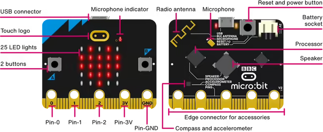

Rust is uniquely positioned to enable the next generation of embedded programming: it can produce bare-metal binaries, where an OS would be too heavy; it is very efficient with memory, and doesn't need a garbage collector; and it does all of this with a rich type system and robust abstractions, ensuring safety and correctness. In fact, the initial spark for Rust, [as the story goes](https://www.technologyreview.com/2023/02/14/1067869/rust-worlds-fastest-growing-programming-language/), came from embedded systems: Graydon Hoare grew frustrated with a buggy elevator which, yet again, meant he had to walk up 21 flights of stairs.

Of course, C and its derivatives have a significant head start: most hardware vendors (with the notable exception of [Espressif](https://github.com/esp-rs)) only provide SDKs and examples in C.

This is where the Rust community did what it does best: rewrite it in Rust! A lot of really dedicated people have been hard at work making Embedded Rust a reality, to the point where it's easy enough to get started in an afternoon with little to no prior experience. It blows my mind that you can write modern, high-level, `async`/`await` code, and run it on a chip with a single `64MHz` CPU and `128KB` RAM. For reference, the laptop on which I'm writing this has over **50x** the CPU speed (not to mention **10x** the cores), and **100,000x** the memory!

In this series of posts, we'll build a temperature & humidity sensor based on the [BBC micro\:bit board](https://microbit.org/get-started/what-is-the-microbit/). My focus is making this as accessible as possible, so we'll keep hardware to a minimum; soldering iron and electronics knowledge not required!

## Hello (embedded) World



:::caption
[Diagram](https://microbit.org/get-started/features/overview/) by the Micro:bit Educational Foundation licensed under [CC-BY-SA 4.0](https://creativecommons.org/licenses/by-sa/4.0/)
:::

The `micro:bit` is a board aimed at hobby and educational projects, and it's great for getting started! It's fairly cheap (£15 at time of writing), and it has enough built-in buttons, LEDs, and sensors that you can definitely use it standalone if you don't want to mess with external components and wiring.

Now we've got a board, let's plug it in via USB and watch it power up! We're also going to grab a few tools: we'll use [probe-rs](https://probe.rs/docs/getting-started/installation/) to 'flash' our program (write it to the board's persistent memory). We also need to set up a Rust toolchain for the ARM Cortex chip on the board; running `rustup target add thumbv7em-none-eabihf` will set this up for us.

Once that's sorted, let's create a fresh project with `cargo new <name>`. You can use a template such as [this one](https://github.com/ImplFerris/microbit-projects/tree/main/bsp/blinky) if you want to skip ahead; read on for a step-by-step explanation of all the bits and pieces involved.

### Dependencies

When following examples / templates, I found this part quite confusing: two projects doing roughly the same thing would use very different sets of dependencies, and it was not clear why. There was a lot of trial and error involved when I tried to combine concepts that used different abstraction layers.

Briefly, the main factor in deciding which dependencies to use is your chosen abstraction layer, from highest to lowest:

1. **Board Support Package (BSP) / crate**: a library providing high-level, safe abstractions for an entire board, including built-in sensors and peripherals. For example, the [`microbit-v2`](https://crates.io/crates/microbit-v2) crate lets you control the on-board LED display as a whole instead of toggling individual pins.
2. **Hardware Abstraction Layer (HAL)**: sits one level below the BSP, and is usually restricted to a single microcontroller. For example, the [`nrf52833-hal`](https://crates.io/crates/nrf52833-hal) crate lets you control pins, hardware timers, and more for this specific chip. It does this by providing concrete implementations of various platform-independent traits defined by [`embedded-hal`](https://crates.io/crates/embedded-hal).
3. **Peripheral Access Crate (PAC)**: sits below the HAL, and is essentially a thin safe wrapper over the special hardware registers that let the chip interact with the outside world. It's usually generated from machine-readable hardware specifications (System View Description files). For example, the [`nrf52833-pac`](https://crates.io/crates/nrf52833-pac) crate.
4. **bare metal / raw Memory-Mapped IO**: if for whatever reason you can't or don't want to use a PAC, you can resort to reading / writing to magic memory addresses like `0x5000_0784` to drive pins and other peripherals.

:::warning
You will get an error if you try to use more than one layer, because they take exclusive ownership of the hardware.
:::

:::callout
Using a BSP or HAL is recommended in almost all cases; you might start with the BSP, and fall back to the HAL if it doesn't fit your use case. There's usually no need to use the other layers, unless there is no HAL and you're writing your own.
:::

With all this in mind, we end up with the following set of minimal dependencies:

```toml
# Cargo.toml

[dependencies]
cortex-m-rt = "0.7.5"
embedded-hal = "1.0.0"
nrf52833-hal = "0.19.0"
```

### Our first valid program

OK, it's finally time to write some embedded Rust! It's like your normal everyday Rust, with a few twists:

1. `#![no_std]`: the Rust standard library relies on a host operating system; obviously for filesystem and network access, but also more subtly every time it needs to allocate memory! We don't have the luxury of an OS here with our 128K of RAM, so we have to use the restricted `core` library instead.
2. `#![no_main]`: the default program entrypoint, which sets up the stack & heap among other things, is also not suitable for embedded targets, and we need to bring our own. Thankfully this is provided by `cortex-m-rt` with the `#[entry]` macro.
3. `#[panic_handler]`: this tells Rust what to do when it encounters a `panic!`. Normally, the standard library provides an implementation that cleanly unwinds the stack, but we got rid of that! We will need to bring our own as well.

Therefore the bare minimum for a program that compiles looks like this:

```rs
// src/main.rs

#![no_main]
#![no_std]

use cortex_m_rt::entry;
use nrf52833_hal as _;

#[panic_handler]
fn panic(_: &core::panic::PanicInfo) -> ! {
    loop {}
}

#[entry]
fn main() -> ! {
    loop {
        // do nothing
    }
}
```

:::callout
You might be wondering why `use nrf52833_hal as _;` is needed if we're throwing away the import. If you remove it, though, it won't compile! This is because the crate defines some global symbols required by `cortex_m_rt`; we could work around that by defining them ourselves, but it's not worth it.
:::

One final bit of config before we can run this:

```toml
# .cargo/config.toml

[build]
target = "thumbv7em-none-eabihf"

[target.thumbv7em-none-eabihf]
runner = "probe-rs run --chip nRF52833_xxAA"
rustflags = ["-C", "link-arg=-Tlink.x"]
```

Assuming your microbit is still plugged in, you should be able to use `cargo run` to flash this program to your board!

```console
$ cargo run
   Finished `dev` profile [unoptimized + debuginfo] target(s) in 0.17s
    Running `probe-rs run --chip nRF52833_xxAA target/thumbv7em-none-eabihf/debug/mb2-blinky`
    Erasing ✔ 100% [####################]   4.00 KiB @  19.46 KiB/s (took 0s)
Programming ✔ 100% [####################]   4.00 KiB @  14.58 KiB/s (took 0s)
   Finished in 0.59s
```

Are you excited to see _nothing_ happening on your board? Great, now let's make that _something_.

### Blinky Light

It's finally time for the embedded version of Hello World: Blinky Light! The challenge is simple: make one of the on-board LEDs turn on and off on a cycle. We're going to add the following imports:

```rs
use embedded_hal::{delay::DelayNs, digital::OutputPin};
use nrf52833_hal::{gpio, pac::Peripherals, timer};
```

And make the following changes to the `main` function:

```rs
#[entry]
fn main() -> ! {
    let peripherals = Peripherals::take().unwrap();
    let gpio0 = gpio::p0::Parts::new(peripherals.P0);
    let mut row1 = gpio0.p0_21.into_push_pull_output(gpio::Level::Low);
    let _col1 = gpio0.p0_28.into_push_pull_output(gpio::Level::Low);

    let mut timer = timer::Timer::new(peripherals.TIMER0);

    loop {
        timer.delay_ms(500);

        row1.set_high().unwrap();

        timer.delay_ms(500);

        row1.set_low().unwrap();
    }
}
```

Now `cargo run`...

<video autoplay loop muted playsinline width="100%">
  <source src="/videos/blinky.webm" type="video/webm">
  <source src="/videos/blinky.mp4" type="video/mp4">
</video>

The light blinks! But you might be staring at those lines thinking "what on earth is going on", so let's go over it step by step.

1. `Peripherals::take()` gives us a handle to the peripherals as defined by the PAC. This is a singleton, and we're asking for exclusive ownership over the hardware. Just like memory, it would be unsafe for multiple pieces of code to change hardware state at the same time, so this will fail (return `Err`) if we call it twice.
2. `gpio::p0::Parts` represents a group of General-Purpose Input Output (GPIO) pins available to the chip. Since this is a 32-bit chip, each group (called 'port') is limited to 32 pins[^1], so the `nRF52833` chip has 2 distinct ports to connect more peripherals.
3. All GPIO pins start in a `Disconnected` state, meaning they do not let any current in or out. We must convert it to the correct pin type depending on what we want to do with it; in this case we want to drive the pins, so we call `into_push_pull_output`, which also sets the initial output level (high/1 or low/0).
4. In order to turn on the top-left LED, we need to set `ROW1` to high and `COL1` to low[^2]. Now, remember the HAL doesn't know about our particular board; it doesn't know what GPIO pins correspond to `ROW1` or `COL1`. We can find out by looking at the [microbit's 'pinmap'](https://tech.microbit.org/hardware/schematic/#v2-pinmap), which tells us `ROW1` is `P0.21` and `COL1` is `P0.28`!
5. Finally, we use a `Timer` to wait a given period of time. You can think of it as a more efficient and reliable way of doing `while elapsed < target { /* nop */ }`

## Reflections

For me, this post was largely an experiment asking the question: "are we embedded yet?"

I hope I've convinced you that the answer is a resounding yes! The tooling is here, there are mid- and high-level abstractions for lots of hardware platforms, and Rust feels right at home in a setting where resources are very limited and reliability is a must.

We've set the foundation, and I encourage you to explore further if you feel so inclined. We'll look at more advanced topics like `async` development, displaying text on the LED matrix, connecting an external sensor, and Bluetooth Low Energy in future posts. Thanks for reading!

## References and further reading

I highly recommend checking out the [Rust embedded book](https://docs.rust-embedded.org/discovery-mb2/index.html) and [impl Rust for Microbit](https://mb2.implrust.com/index.html). They complement each other well: the book covers hardware fundamentals like interrupts in a lot of depth, and `impl Rust` introduces `async` development with `embassy`.

<!-- FOOTNOTES -->

* * *

[^1]: this is because GPIO pins are controlled by writing to special registers, with each bit controlling a distinct pin, so 'ports' are just different sets of registers
[^2]: this is a typical set up for LED matrices; instead of allocating NxM pins to drive each LED independently, we only use N+M pins corresponding to the rows and columns
